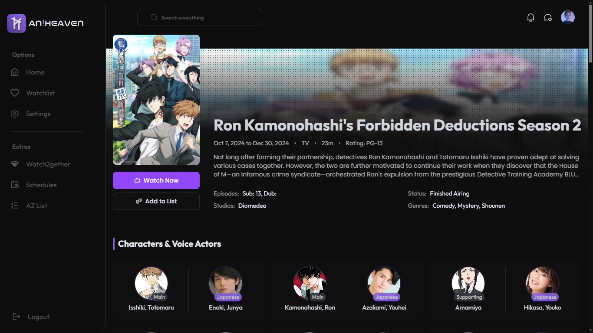
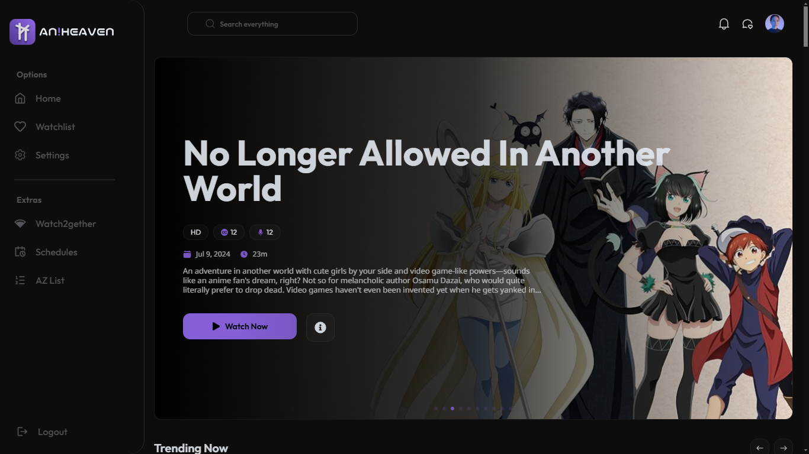
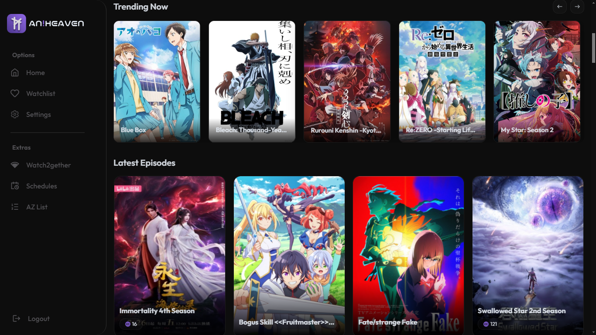
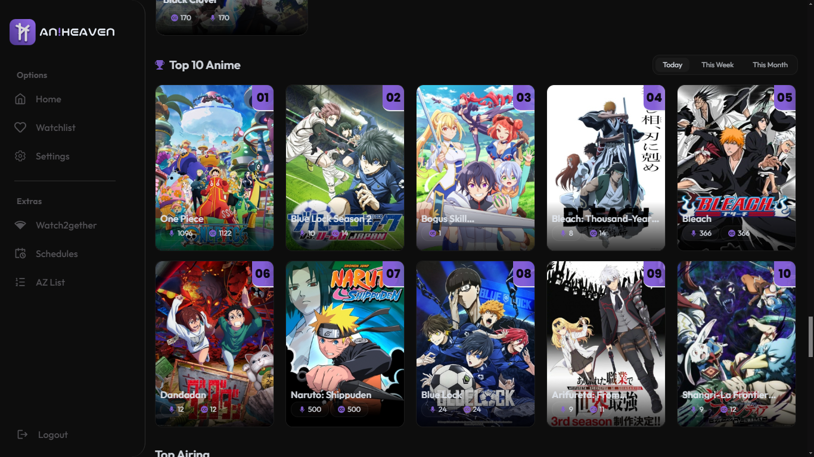
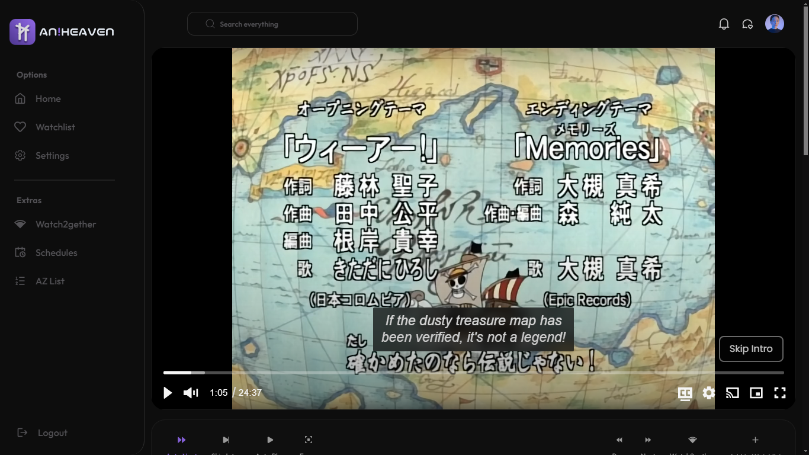
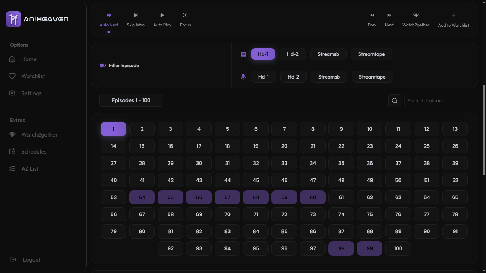
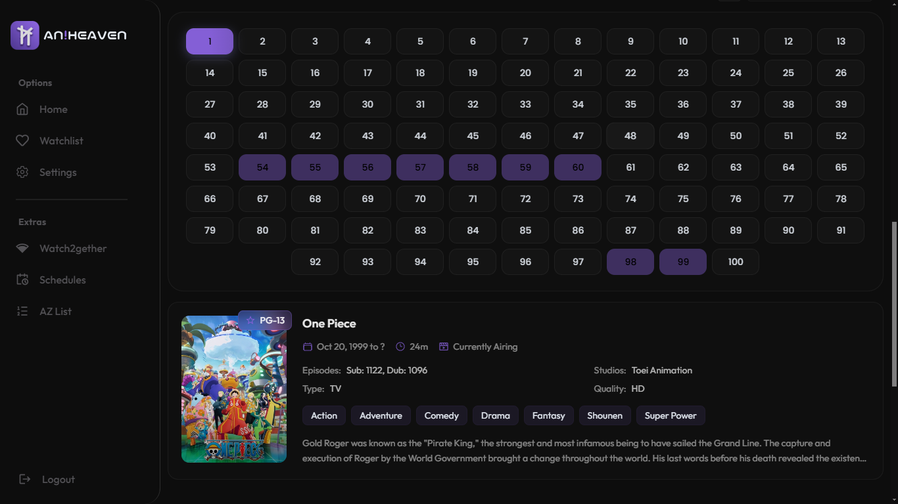
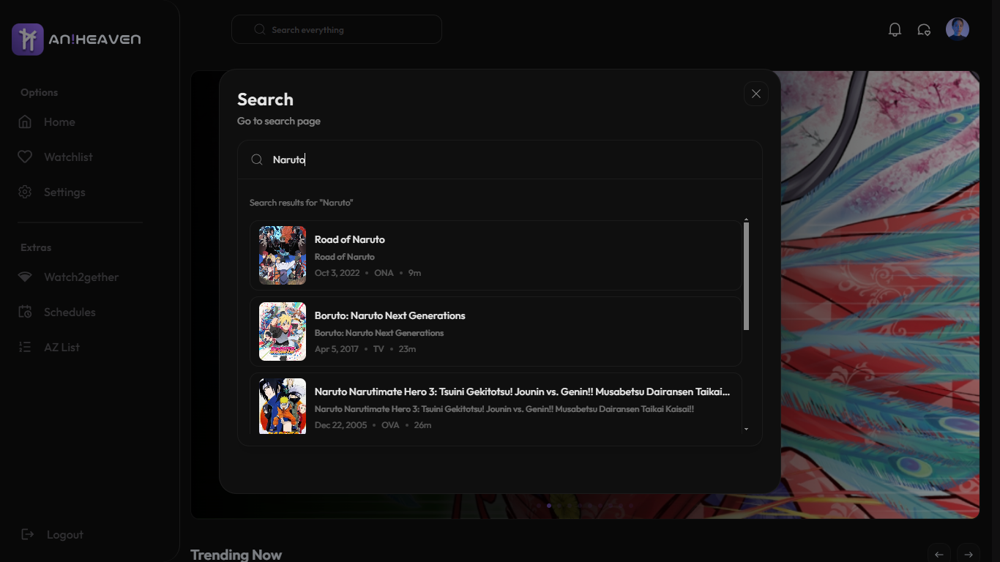
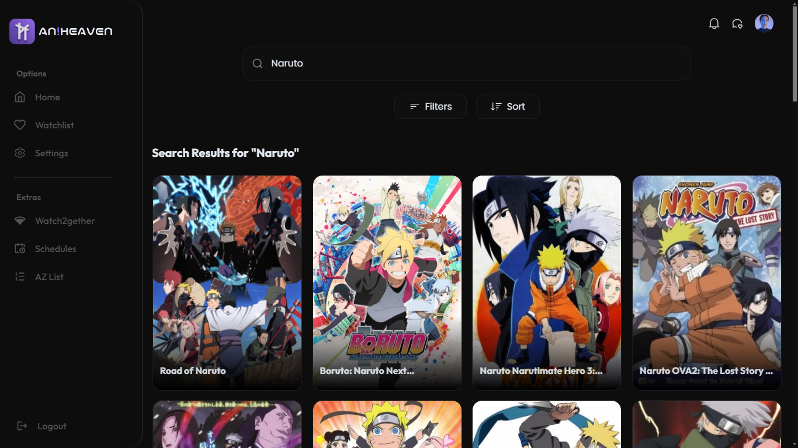

# ✨ AniHeaven - The Modern Anime Experience

<div align="center">
  
  <h3>A streaming platform built different. ⚡</h3>

[](https://reactjs.org/)
[](https://vitejs.dev/)
[](https://tailwindcss.com/)
[](LICENSE)

  <p align="center">
    <a href="#demo">Live Demo</a>
    ·
    <a href="#features">Key Features</a>
    ·
    <a href="#installation">Get Started</a>
    ·
    <a href="#contributing">Contribute</a>
  </p>
</div>

## 🎬 About The Project

Let's be real—most anime sites feel like they're stuck in the past. AniHeaven is our answer to that. We wanted a platform that feels modern, fast, and actually enjoyable to use. No clutter, no lag, just the content you want with a UI that passes the vibe check.

Built with the latest tech stack, it’s designed for speed and simplicity. Best of all? It's completely open-source.

## ✨ Features

### 🎥 Superior Video Player
- **Smart Playback:** Auto-skips intros (because time is money) and auto-next episode.
- **Resume Watching:** We remember exactly where you left off.
- **Keyboard Shortcuts:** Full control without touching the mouse.
- **Quality Control:** HLS streaming that adjusts to your connection.

### 🎨 UI & UX
- **Clean Aesthetic:** Dark mode by default (your eyes will thank us).
- **Responsive:** Looks great on your phone, tablet, or desktop. No cap.
- **Smooth Animations:** Powered by Framer Motion for that premium feel.

### 🚀 Performance
- **Blazing Fast:** Built with Vite for instant loading.
- **Optimized:** Heavy caching and lazy loading means zero buffering.
- **Stability:** A bug-free experience that just works.

### 🎯 Discovery
- **Advanced Search:** Find exactly what you're looking for.
- **Tracking:** Keep track of your watch history and save your favorites.
- **Smart Recommendations:** We'll help you find your next obsession.

## 🛠️ The Tech Stack

We used the best tools in the game to make sure this project runs smoothly.

<details>
<summary>View Technical Details</summary>

### Frontend
- **Core:** React 18.3.1
- **Build Tool:** Vite 5.4.8
- **Styling:** TailwindCSS, DaisyUI, Framer Motion

### State & Routing
- **State:** Recoil & TanStack React Query
- **Routing:** React Router DOM

### Media & Player
- **Player:** Vidstack React, React Player
- **Streaming:** HLS.js

### Utilities
- **UI Components:** Swiper, React Icons, React Hot Toast
- **Progress:** NProgress
- **Linting:** ESLint, Prettier, Husky

</details>

## 🚀 Getting Started

Want to run this locally? It's a breeze.

### Prerequisites
- Node.js 16.x or higher
- npm or yarn
- Git

### Installation

1. **Clone the repo:**
   ```bash
   git clone https://github.com/yourusername/aniheaven.git
   ```

2. **Install dependencies:**
   ```bash
   cd aniheaven
   npm install
   ```

3. **Start the dev server:**
   ```bash
   npm run dev
   ```

## 📱 Gallery

Here's a sneak peek at what we've built:

<div align="center">
  
  
  
  
  
  
  
  
  
</div>

## 🤝 Contributing

Got an idea to make AniHeaven even better? We love to see it.

1. Fork the Project
2. Create your Feature Branch (`git checkout -b feature/AmazingFeature`)
3. Commit your Changes (`git commit -m 'Add some AmazingFeature'`)
4. Push to the Branch (`git push origin feature/AmazingFeature`)
5. Open a Pull Request

## 📜 License

Distributed under the MIT License. See `LICENSE` for more information.

## 🙏 Acknowledgments

Big shoutout to the APIs and tools that make this possible:

- **HiAnime API** for the content
- **MAL/Jikan API** for the metadata
- The open-source community for being the real MVP

---

<div align="center">
  Built with 💜 by anime fans.
  
  [Live Demo](https://aniheaven.vercel.app) · [Report Bug](https://github.com/Raaaaaaamim/aniheaven/issues) · [Request Feature](https://github.com/Raaaaaaamim/aniheaven/issues)
</div>
